<h2>Activité Pratique N°1 - Développement d'un micro-service</h2>

1. Créer un projet Spring Boot avec les dépendances Web, Spring Data JPA, H2, Lombok

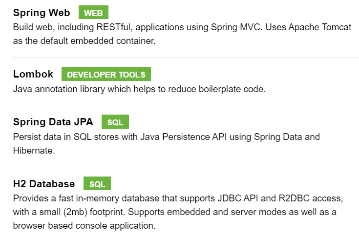

2. Créer l'entité JPA BankAccount

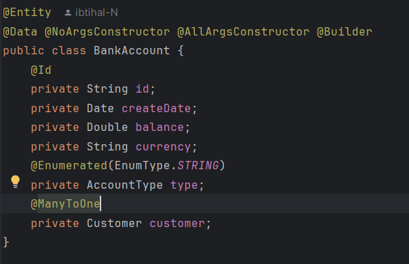

3. Créer l'interface BankAccountRepository basée sur Spring Data

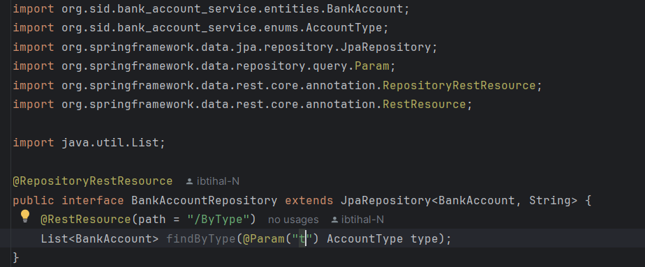

5. Créer le Web service Restfull qui permet de gérer des comptes

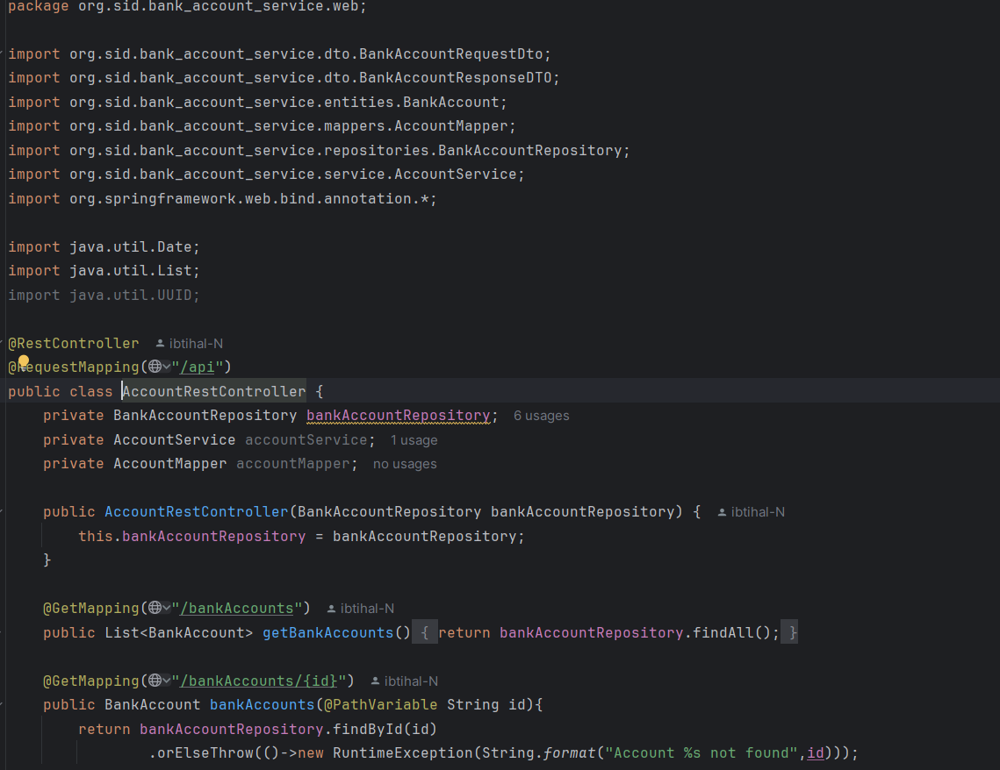

6. Tester le web micro-service en utilisant un client REST comme Postman

8. Exposer une API Restful en utilisant Spring Data Rest en exploitant des projections

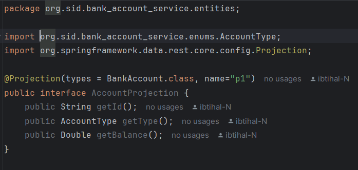

9. Créer les DTOs et Mappers

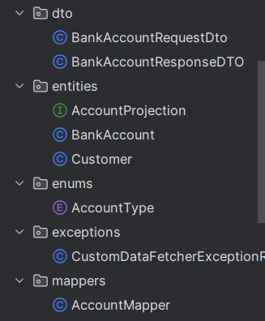
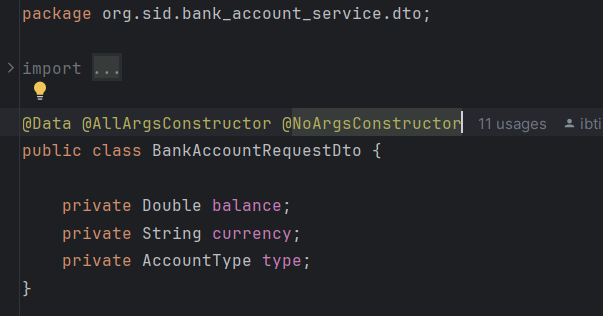
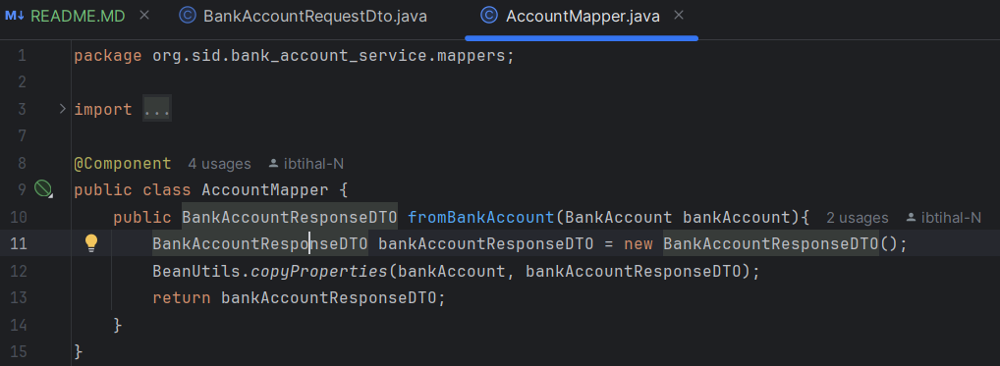

10. Créer la couche Service (métier) et du micro service

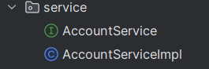
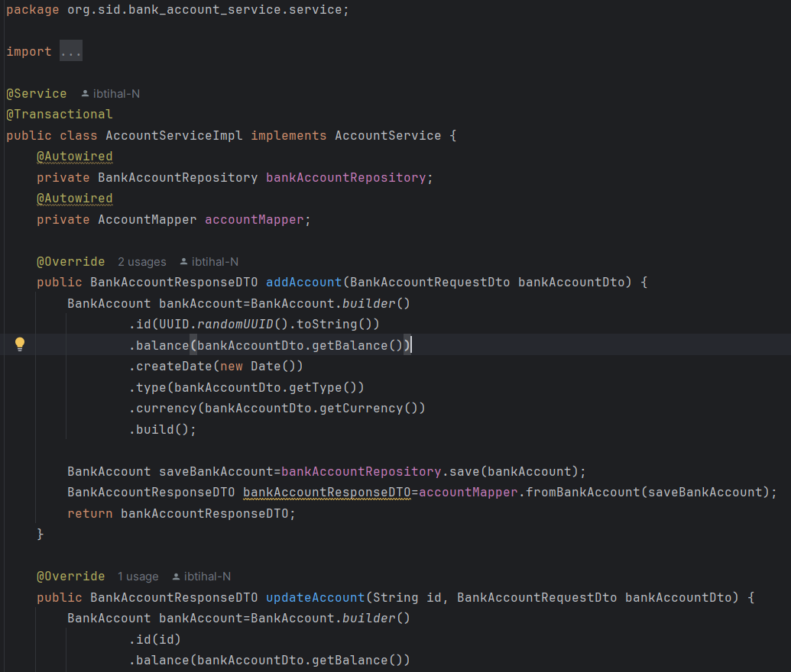

11. Créer un Web service GraphQL pour ce Micro-service

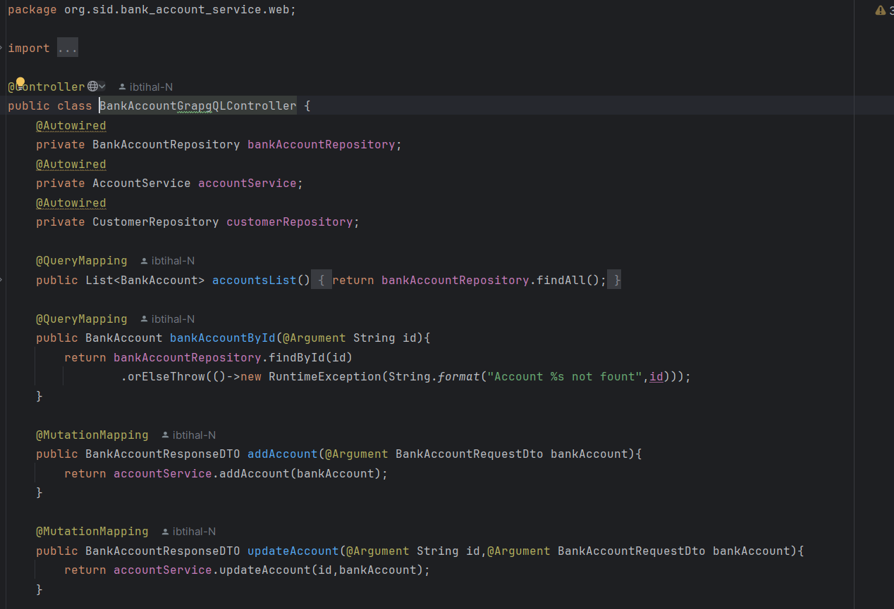
